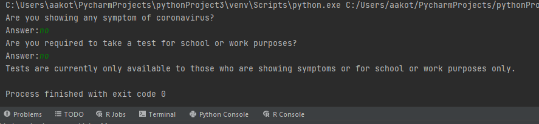
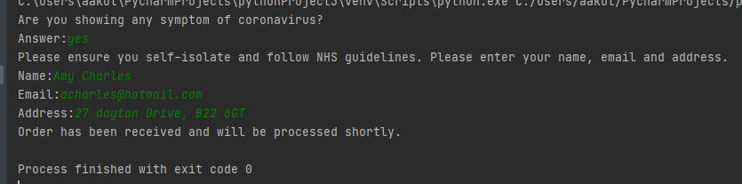
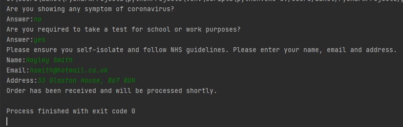

# Python

Mini Python Projects

A series of projects that include different variations of User Input Programmes which demontrates how the code will output with user input.

[Project 1 – Creating a random number guessing game:](https://gist.github.com/angongcelenica/693535b5cc9d2b51ffb3b7c6b8c6fadb) 

This code demonstrates how I created a random number guessing game using input functions for the user to type in any number of choice to generate a reponse on whether the user won the game or not.

[Project 2 – Creating a selection menu for a restaurant order:](https://gist.github.com/angongcelenica/c80a53c2391ab99ab1996e8b6ec8db5b)

I coded a User input programme to create a resturant style menu which asks the user what starter, main course, dessert and drink of their choice. The output displays the full order of the customer.

[Project 3 – Creating an interactive programme number game:](https://gist.github.com/angongcelenica/8ea1e8c3e92dd17b71bc960d8c2d3d0e) 

This code shows how to create an interactive number guessing game. The user has to guess any number between 1-100; I programmed the game to have a few selection of numbers between 1-100 that will output a joke, if the user guessed the number correctly and any number outside that selection will not generate a joke.

[Project 4 – Coronavirus Home-Testing Kit Eligibilty](https://gist.github.com/angongcelenica/16935023c169e94ff061220cd3b6d9e9) 

This is an example of a data flow diagram I created to plan, breakdown and visualise the steps to create a User Input Programme. The goal was to create an eligibility criteria for customers to order a Coronavirus Home-Testing kit. Using the data flow diagram I executed the code that would create this User Input Programme with multiple conditions in order to filter out the users that were elgible for the home-testing kits from those that would not be able to qualify.

 

[Project 5 – Creating procedures and passing parameters to perform calculations](https://gist.github.com/angongcelenica/d67ee1ab5db278d64f08f1d892f00856)

[Project 6 - Creating a student grade converter](https://gist.github.com/angongcelenica/03a097d42832bca3902beb7488777bb3)

This code demonstrates how I created a grade converter for students to convert percentages into a grade. It also has a condition that if the percentage falls below 50% then the output will change into a 'You have failed' message instead of a grade.

[Project 7 - Yearly motorbike depreciation of 10% until it reaches below £1000](https://gist.github.com/angongcelenica/a49161146cfd4b880d26a99afa1fe4e7)

This code demonstrates a loop programme to show the 10% yearly depreciation of a motorbike until it reached below £1000. The starting price of the motorbike was £2000 and the programme calculated and printed the result for each year until it finally hit below £1000 in Year 8.

